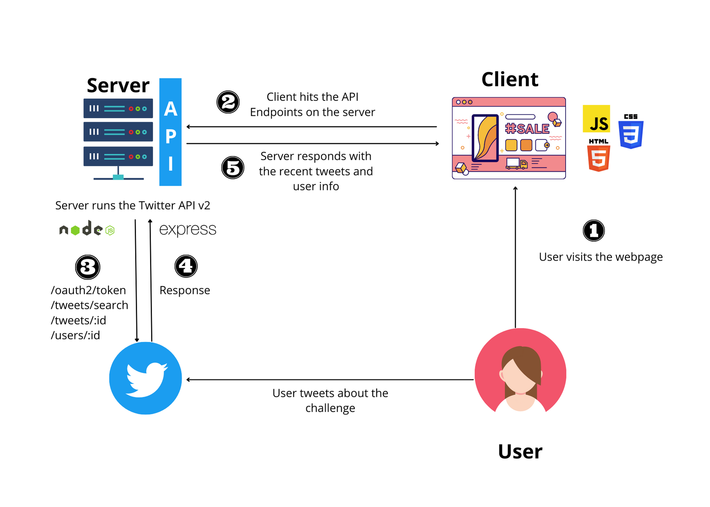

<!-- omit in toc -->
# 100 Days of Love Challenge | Team - *<WhoRunTheCode?Girls! />*
- [Team Members](#team-members)
- [100 days of Love Challenge - About the App](#100-days-of-love-challenge---about-the-app)
- [Features of the App](#features-of-the-app)
- [Architecture of the App](#architecture-of-the-app)
- [Technologies and Standards Used in UI/UX](#technologies-and-standards-used-in-uiux)
- [Technologies and Standards Used in Frontend Development](#technologies-and-standards-used-in-frontend-development)
  - [!Javascript](#)
  - [!NodeJS](#-1)
  - [!ExpressJS](#-2)
  - [!Postman](#-3)
- [Product Specification Document](#product-specification-document)
- [Steps to run the App on local machine](#steps-to-run-the-app-on-local-machine)
- [Future Improvements](#future-improvements)
- [Live Website](#live-website)

## Team Members

1. [Yuffie Hu](https://github.com/yuff1006) | Web Developer
2. [Nitzan Smulevici](https://github.com/nitzanye) | Web Developer
3. [Shraddha](https://github.com/5hraddha) | Web Developer

## 100 days of Love Challenge - About the App
> “*Love is not words, it's actions. Love isn't feelings, it's a decision. Let's make it a habit.*”.

Valentine’s day is such a fun day, but it comes once a year. That’s why we’ve come up with **100 Days Of Love Challenge** , a 100-day challenge that helps you to celebrate your love with the world daily and encourage others too to do the same.

These little gestures of love can cheer up someone who has a difficult day, give someone feeling lonely a smile or laugh, or even improve your relationship with them.

## Features of the App
1. Gives you a challenge everyday to encourage you to extend your love and care to someone else.
2. Have functionality to share your tweet on Twitter. The tweet message has been pre-filled for you with our hashtag *#100daysoflovechallenge*.
3. The webpage also gives the freedom to user to select any other challenge that they might want to try through a slider.
4. And the best part is that the webpage is connected to Twitter API to pull the list of all the users who have recently attempted the challenge and tweeted it. We even route you to the fellow users' twitter profile who are in this challenge with you.

## Architecture of the App


## Technologies and Standards Used in UI/UX

**There are various tools that have been used throughout the project design and development:**
| Tools | Usage |
|---------------------------------------------------|---------------------------------------------------|
| Figma | For referring to the product design specification |
| [TinyPng](https://tinypng.com/) | For JPEG/PNG Image Compression |
| [SVGOMG](https://jakearchibald.github.io/svgomg/) | For refining and compressing SVGs |

## Technologies and Standards Used in Frontend Development

**The technologies that have been used are:**

1. HTML (Hyper Text Markup Language)
2. CSS (Cascading Style Sheets)
3. JavaScript
4. Node.js
5. Express Framework (for development)
6. Postman (for testing API endpoint)

### 
- **Javascript** has been use dto code the frontend of the webpage and add interactivity to it.
### 
- **Node** (or more formally *Node.js*) is an *open-source*, *cross-platform* runtime environment that allows developers to create all kinds of server-side tools and applications in JavaScript. 
- *Node. js* is primarily used for non-blocking, event-driven servers, due to its single-threaded nature. 
- It's used for traditional web sites and back-end API services.

### 
- **Express** is the most popular Node web framework, and is the underlying library for a number of other popular Node web frameworks. 
- It provides mechanisms to:
  - Write handlers for requests with different HTTP verbs at different URL paths (routes).
  - Integrate with "view" rendering engines in order to generate responses by inserting data into templates.
  - Set common web application settings like the port to use for connecting, and the location of templates that are used for rendering the response.
  - Add additional request processing "middleware" at any point within the request handling pipeline.

### 
- **Postman** is an API client that makes it easy for developers to create, share, test and document APIs. 
- This is done by allowing users to create and save simple and complex HTTP/s requests, as well as read their responses.

**The main concepts that have been emphasized are:**

1. Responsive Web Design
2. [CSS Grid](https://css-tricks.com/snippets/css/complete-guide-grid/)
3. [CSS Flexbox](https://css-tricks.com/snippets/css/a-guide-to-flexbox/)
4. API is using to access the users Twitter data.

The website is using [BEM — Block Element Modifier](https://en.bem.info/methodology/quick-start/) methodology to create reusable and understandable components in CSS. The idea behind it is to divide the user interface into independent blocks. This makes interface development easy and fast and it allows reuse of existing code without copying and pasting. We are also using [Nested BEM File structure organization](https://en.bem.info/methodology/filestructure/#nested) for CSS.

## Product Specification Document

You can view the product specification document [here](https://www.figma.com/file/6t9dKE7hSvhJvyRRsEyevr/Untitled?node-id=2%3A2).

## Steps to run the App on local machine
```shell
# Clone the repository
git clone https://github.com/5hraddha/100daysoflovechallenge.git

# Navigate to the code repository & install packages needed to run frontend & backend concurrently
cd 100daysoflovechallenge
npm install

# Install packages needed to run frontend code
cd frontend
npm install

# Install packages needed to run backend code
cd ../backend
npm install

# Start the frontend & backend server concurrently
cd ..
npm run dev
```

## Future Improvements
1. Enables users to login and have their profiles.
2. Implement a users dashboard where they can view their status.

## Live Website
Enjoy the live web app [here](https://100daysoflove.netlify.app/).  

[](https://app.netlify.com/sites/100daysoflove/deploys)
